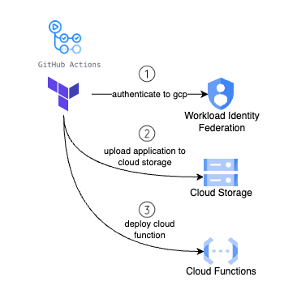

# XPLORERS GOOGLE CLOUD INFRASTRUCTURE SETUP

Terraform to bootstrap google cloud infrastructure for Xplorers applications. Enables service APIs, creates necessary resources like storage bucket and any permissions required by the applications.

## Prerequisites

### Required software
* [Google Cloud CLI](https://cloud.google.com/sdk/docs/install)
* [Terraform CLI](https://developer.hashicorp.com/terraform/cli)

### Login to Google Cloud via gcloud cli + setup application default credentials via Application Default Credentials (ADC)

Run [***gcloud init***](https://cloud.google.com/sdk/gcloud/reference/init) to authorize gcloud and other SDK tools to access Google Cloud using your user account credentials.

Run [***gcloud auth application-default login***](https://cloud.google.com/sdk/gcloud/reference/auth/login) to obtain access credentials for your user account via a web-based authorization flow. When this command completes successfully, it sets the active account in the current configuration to the account specified. If no configuration exists, it creates a configuration named default.

> ***Your gcloud credentials are not the same as the credentials you provide to ADC using the gcloud CLI.***

### Default configuration variables

The entrypoint for this repository is in the file `configuration/defaults.conf` which stores necessary environment variables used by the Makefile to orchestrate and apply the changes using Terraform. Change these values according to your project configuration,

* `BACKEND_BUCKET_NAME` - The name of google cloud storage bucket to create and use with Terraform
* `BACKEND_BUCKET_STORAGE_CLASS` - Storage class to use with google cloud storage bucket
* `BACKEND_BUCKET_TERRAFORM_PREFIX` - Bucket prefix to store terraform state information
* `GOOGLE_CLOUD_PROJECT_ID` - Google Cloud project ID to use
* `GOOGLE_CLOUD_PROJECT_REGION` - Google Cloud region to use
* `GOOGLE_CLOUD_PROJECT_ZONE` - Google Cloud zone to use

## Validating and applying configuration to Google Cloud

Because terraform's backend uses google cloud storage, we need to enable storage API and create a storage bucket first. Run make command `make create-artifacts-bucket` to enable the API and create the storage bucket.

Once the bucket has been created, run the following commands to validate and apply the configuration,

1. Run `make init` to initialize terraform's backend and providers.
    1. Google provider is setup.
    2. Google cloud storage is used to store terraform's configuration. State locking is also supported.

2. Run `make plan` to generate a plan for the changes to be applied to Google Cloud.

3. Once you have reviewed the changes to be applied, run `make apply` to apply changes to Google Cloud.

To delete all the resources created by Terraform, run `make destroy`.

## Features and services enabled in Google Cloud

* Enable the following Google Cloud Service APIs,
    * storage.googleapis.com
    * cloudfunctions.googleapis.com
    * cloudbuild.googleapis.com,
    * cloudresourcemanager.googleapis.com,
    * iam.googleapis.com,
    * secretmanager.googleapis.com,
* Create a storage bucket to store terraform state information.
* Use terraform provider gh-oidc to deploy workload identity pool and provider, service account and custom IAM role.

## CI/CD with Github Actions and Google Cloud Workload Identity Federation

Historically, applications running outside the Google Cloud had to rely on service account keys to access resources within the Google Cloud. However, as service account keys are long-lived credentials with permissions to interact and change the state of resources in the cloud, they pose a security risk if not managed appropriately.

Fortunately, through [workload identity federation](https://cloud.google.com/iam/docs/workload-identity-federation), external identities can be granted IAM roles, including the capability to impersonate service accounts and obtain a short-lived token. This approach effectively eliminates the security and maintenance overhead associated with service account keys.

[Service account impersonation](https://cloud.google.com/iam/docs/workload-identity-federation#impersonation) is used toobtain a short-lived OAuth 2.0 access token which lets github actions impersonate the service account to interact with Google Cloud APIs and deploy the application. Also see this [blog post](https://cloud.google.com/blog/products/identity-security/enabling-keyless-authentication-from-github-actions) to understand the github actions workflow with Google Cloud.

